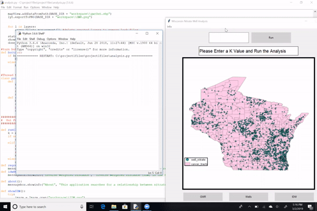

# Python Nitrates App

This is a desktop app for analyzing and displaying nitrates data collected in Wisconsin.

I created it for a capstone course while attending grad school at the University of Wisconsin-Madison in 2019.

## Dependencies

* [ArcPy](https://pro.arcgis.com/en/pro-app/latest/arcpy/get-started/what-is-arcpy-.htm) - python library for ArcGIS Pro

## View

[Here's a video of me demonstrating the app for my classmates, as depicted in this gif:](https://www.youtube.com/watch?v=GXMBKPshLW4)

[]
